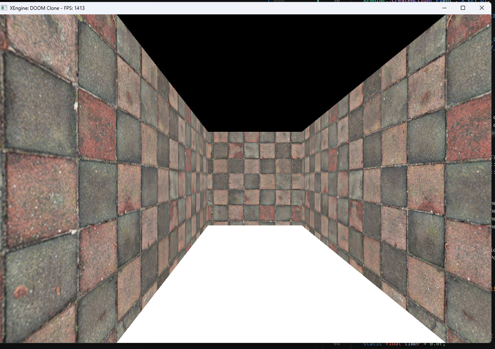
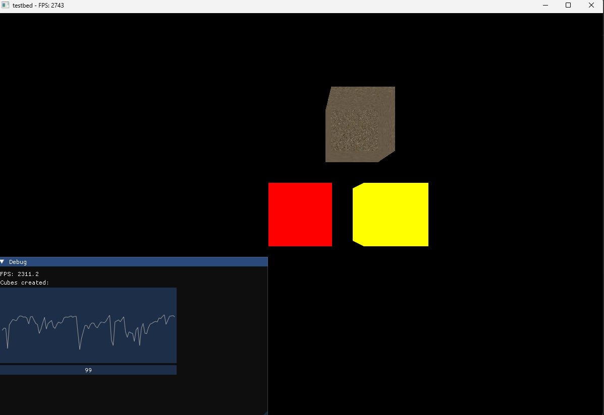
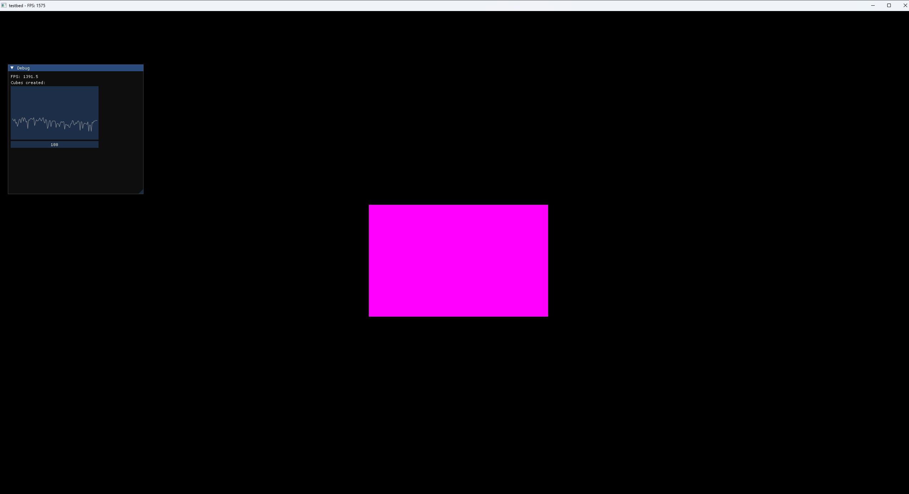

# Xethium Engine

## Lightweight cross-platform 3D engine written in C++

**Xethium Engine** is a lightweight, visually rich engine that's still heavily under development.\
It supports Windows and Linux as of May 2026.

## Free and open source
**Xethium Engine** will stay free and open source forever under the [MIT License](https://github.com/ShaderHex/Xethium-Eng/blob/main/LICENSE)




## Plans for the future
- [x] Framebuffer
- [x] ECS
- [ ] New renderer
- [ ] ECS memory usage optimization
- [ ] Lighting
- [ ] Shadow map
- [ ] CSM
- [ ] Post-processing support
- [ ] Bloom
- [ ] SSAO implementation after migrating to OpenGL 4.5

## Current Features
- OpenGL renderer
- Framebuffer rendering
- ECS architecture
- Primitive Cube generation and rendering
- Input system
- Cross-platform support

## Known Bugs/Issues
- Depth test is wrong
- Linux build scripts are unstable
- Framebuffer does not scale properly to the window size

## How to clone and build
These tools are required to build Xethium:
- C++20
- GCC

Clone the repository
SSH:
```bash
git clone git@github.com:ShaderHex/Xethium-Eng.git
```

HTTP:

```bash
git clone https://github.com/ShaderHex/Xethium-Eng.git
```

and run the following scripts inside the cloned directory
```bash
./build-all.bat
```
to build both the engine and the testing tool (TestBed) 

```bash
cd engine
./build.bat
```
To just build the engine:

```bash
cd testbed
./build.bat
```
To just build Test Bed:
